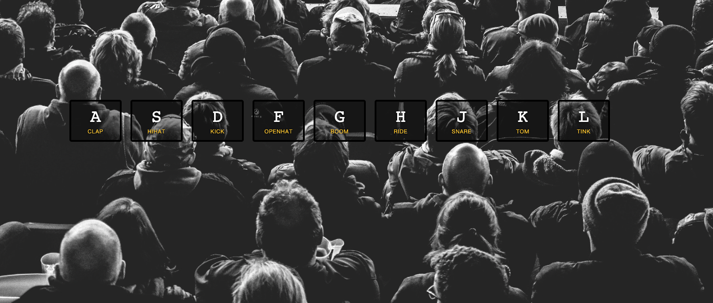

# ****Exercise 1: JavaScript Drum Kit****



## achieve the desired effect(**達到預期的效果**)：

模擬一個打鼓畫面，當使用者按下ASDFGHJKL時，網頁上的字母按鈕會變大變亮且會發出對應的鼓聲

## step breakdown (**步驟分解):**

- 在window上添加鍵盤的 **keydown** 事件
  ```
  window.addEventListener('keydown', playHandler)
  ```

- 創建新的function 找到對應按鈕的DOM 以及 所對應的音樂，並且發出聲音並製作變大動畫(用css放大圖片)
  ```
  const playHandler = (e) => {
  const audio = document.querySelector(`audio[data-key = "${e.keyCode}"]`);
  const dom = document.querySelector(`div[data-key = "${e.keyCode}"]`)
    if (audio) {
      audio.currentTime = 0
      audio.play()
    }

    if (dom) {
      dom.classList.add('playing')
    }
  }
  ```
- 解決圖片只放大不縮小
  ```
  document
    .querySelectorAll(".key")
    .forEach((key) => key.addEventListener("transitionend", transitionendHandle));
  const transitionendHandle = (e) => {
    if (e.propertyName === 'transform') {
      e.currentTarget.classList.remove('playing')
    }
  }
  ```

## Basic grammar (基礎語法)

### **keydown, keyup 的差異**

先來看看ＭＤＮ的解釋：

💡 The `keydown` event is fired when a key is pressed.
💡 當我們按下鍵盤時，就會觸發 `keydown` 事件

以下是`keydown` 的特性：

- 按下任何按鍵時觸發，包含 ESC 、 ENTER 鍵等等。
- 連續按著按鍵，會連續觸發事件。
- 這時取 input 的值會是輸入前的值

💡 The `keyup` event is fired when a key is released.
💡 當我們按下鍵盤後，離開按鍵時才會觸發`keyup` 事件

以下是`keyup` 的特性：

- 這時取 input 的值會是輸入完的值。

---

### **target 跟 currentTarget的差別**

### 先說一下常用的Event.target

它可以接收事件，以及讓監聽者註冊到上面。DOM元素、document、window物件，是最常見的EventTarget物件。

EventTarget物件中有三個方法:

- `addEventListener`: 在事件對象上加入事件監聽者
- `removeEventListener`: 從事件對象移除事件監聽者
- `dispatchEvent`: 送出事件給所有有訂閱的監聽者

EventListener(事件監聽者)或稱為事件處理函式，可以自動得到事件傳入參數值，以此可以存取得到事件的屬性與方法

💡 W3C標準中對於[EventListener](https://www.w3.org/TR/DOM-Level-2-Events/events.html#Events-EventListener)也有定義它是一個介面，作為事件監聽者之用


### 那什麼又是Event.**currentTarget**

💡 **在W3C標準的定義中，`this`會相等於`event.currentTarget`**

永遠會指向目前的事件目標對象

💡 ***currentTarget始終是監聽事件者，而target是事件的真正發出者。***


---

### Array.from()

`Array.from()`方法會從類陣列（array-like）或是可迭代（iterable）物件建立一個新的 `Array`
 實體。

💡 ***ArrayLike對象不能使用push、map等方法，但具有length的屬性，可以進行更迭的操作。***

💡 ***利用array.keys()拿出這個陣列的迭代器，就是Iterable***

`Array.from(object, mapFunction, thisValue)`

- **object：**
    
    此參數保存將轉換為數組的對象
    
- **mapFunction：**
    
    此參數是可選的，用於調用數組的每個項目。
    
- **thisValue：**
    
    此參數是可選的，它保存要作為 this 傳遞的上下文，以便在執行 mapFunction 時使用。如果傳遞了上下文，那麼每次調用回調函數時都會這樣使用，否則默認使用 undefined。
    
    在原作者的code上是有Array.from()，但此版本沒有。原因是document.querySelectorAll回傳的是 array-like ，因為Array.forEach() 是可以處理 array-like 的，所以在不考慮相容性的狀況可以不使用。

---

### currentTime

定義：

currentTime 屬性設置或返回音頻/視頻播放的當前位置（以秒為單位）。

設置該屬性時，播放會跳轉到指定位置。

Set the currentTime property:

*audio|video*.currentTime="*seconds*"

```
  audio.currentTime = 0
  audio.play()
```

這段程式是說：每次播放聲音前, 將播放進度設定回原點, 然後再播放

[HTML Audio/Video DOM Reference](https://www.w3schools.com/tags/ref_av_dom.asp)

---

### `<kbd>`＆`<audio>`

`The <kbd> HTML element represents a span of inline text denoting textual user input from a keyboard, voice input, or any other text entry device.`

`<kbd>是一個鍵盤輸入的元素，用於表示使用者輸入。他將產生一個行內元素`

The **`Audio()`** constructor creates and returns a new `[HTMLAudioElement](https://developer.mozilla.org/en-US/docs/Web/API/HTMLAudioElement)` which can be either attached to a document for the user to interact with and/or listen to, or can be used offscreen to manage and play audio.

<audio>**構造函數創建並返回一個新的 HTMLAudioElement，它可以附加到文檔以供用戶交互和/或收聽，也可以在屏幕外用於管理和播放音頻。**

- controls 音樂控制設定，這是控制 **播放/暫停和音量** 必要的設定
- autoplay 自動播放

---

### add remove & toggle

兩個有什麼差別呢？

**`classList.toggle("testClass")`**

**如果標籤的Class存在testClass，刪除testClass**

**如果標籤的Class不存在testClass，新增testClass**

以這個 code 來說，不適合使用toggle，因為code會像無窮迴圈一直在那邊開關開關，會無法停止